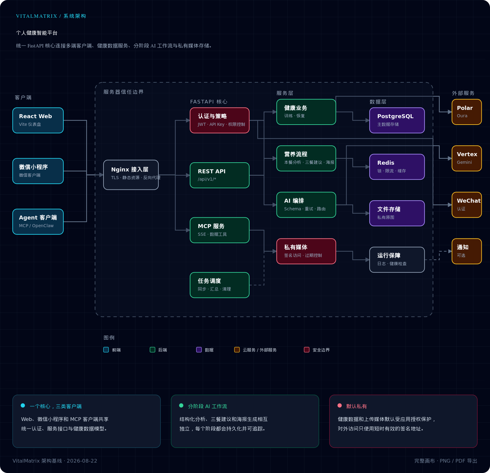
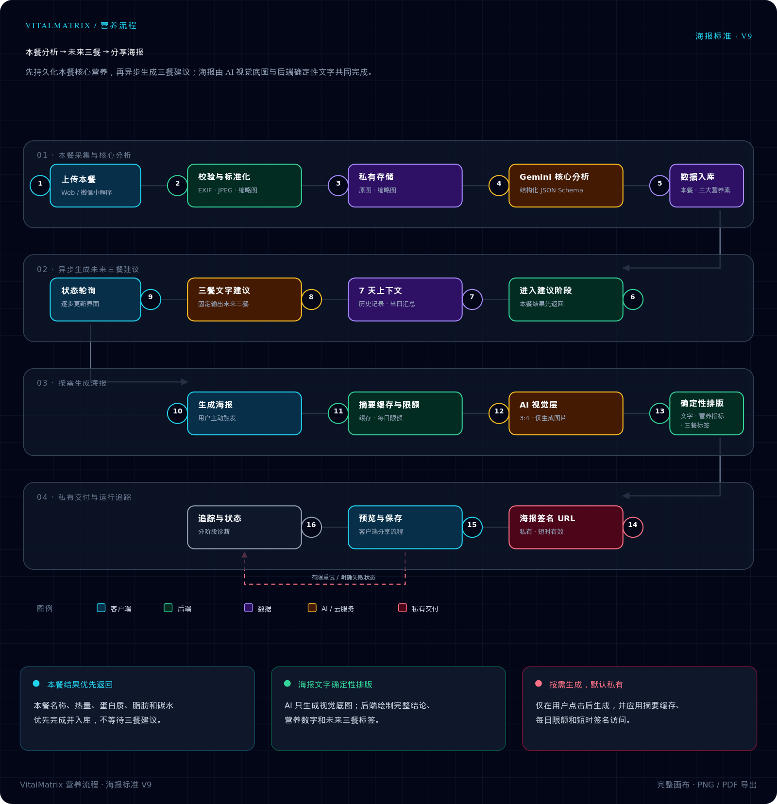

# VitalMatrix

个人健康数据与 AI 分析系统，整合 Polar 训练数据、Oura 恢复数据、营养记录，并提供 Web Dashboard、微信小程序和 MCP 接入能力。

## 功能概览

- Polar 训练数据同步与训练指标汇总
- Oura 睡眠、准备度、活动、压力等恢复数据同步
- Codex CLI / GPT-5.6 Luna 驱动的 AI 每日建议、风险标记与趋势分析
- 营养照片上传、分阶段识别、未来三餐建议与每日营养汇总
- 按需生成 3:4 分享海报；关键营养数字和中文内容由后端确定性排版
- Web Dashboard 与微信小程序双端展示
- 内嵌 MCP 服务，支持外部 Agent / Client 通过 SSE 接入

## 仓库结构

```text
backend/        FastAPI 后端服务，包含 API、数据同步、AI、MCP、定时任务
web/            React + TypeScript Dashboard
miniprogram/    微信小程序前端
config/         提示词与配置模板
deploy/         部署示例与 Nginx 配置
docs/           架构与集成文档
```

## 系统架构



需要复制或导出高清 PNG/PDF 时，请下载 [HTML 交互版](docs/diagrams/vitalmatrix-system-architecture.html) 后用浏览器打开。

- `backend/` 是核心服务，提供 REST API、定时同步、AI 生成和 MCP。
- `web/` 提供桌面/移动浏览器可访问的可视化 Dashboard。
- `miniprogram/` 提供微信小程序端体验。
- MCP 已内嵌在后端中，不再单独维护独立 `mcp-server/` 服务。

主要访问入口：

- REST API: `/api/v1/*`
- Dashboard: 由 Nginx 托管 `web/dist`
- MCP SSE: `/mcp/sse`
- MCP REST-style data endpoints: `/api/v1/mcp/*`

## 营养分析与海报流程



核心营养分析、未来三餐建议与按需海报生成采用分阶段流程。需要导出时，请下载 [HTML 交互版](docs/diagrams/nutrition-poster-workflow.html)。完整维护和安全约定见 [架构图说明](docs/diagrams/README.md)。

## 技术栈

- Backend: FastAPI, SQLAlchemy, PostgreSQL, Redis, APScheduler
- AI: Codex CLI，GPT-5.6 Luna 识图 Medium / 文本 Low，GPT Image 2 海报
- Web: React, TypeScript, Vite
- Mini Program: WeChat Mini Program
- Deploy: Linux, Nginx, systemd / supervisor

## 当前 AI 模型与分析流程

当前后端通过服务器 Codex CLI 登录态调用 GPT 系列，不使用 Gemini 作为当前分析引擎。模型和推理强度由后端配置管理：

| 任务 | 默认模型 | 推理强度 |
|------|----------|----------|
| 饮食照片识别与本餐营养估算 | `gpt-5.6-luna` | Medium |
| 每日健康建议、后续三餐建议、AI 对话 | `gpt-5.6-luna` | Low |
| 分享海报底图 | `gpt-image-2` | 图片生成任务 |

上传接口先返回核心识图结果，三餐建议在后台生成。每日建议采用最多 90 天历史统计，明确区分改善、恶化、稳定和数据不足；营养均值仅代表已记录餐次，不冒充全天摄入。历史分析保留原模型信息。

本轮优化包括并发上传去重、后台模型容量限制、有限重试、超时与中断恢复、旧结果写入保护。具体统计口径、验证结果及小程序接口适配见 [AI 上下文与饮食链路优化](docs/2026-09-18-ai-context-and-nutrition-performance.md)。

## 快速开始

### 1. 克隆仓库

```bash
git clone https://github.com/anon019/VitalMatrix.git
cd VitalMatrix
```

### 2. 初始化后端环境

```bash
cd backend
python -m venv venv
source venv/bin/activate
pip install -r requirements.txt
cp .env.example .env
```

然后按实际部署填写 `backend/.env`。

### 3. 配置环境变量

编辑 `backend/.env`，填入：

- 数据库连接
- Redis
- Polar OAuth
- Oura OAuth
- CODEX_CLI_PATH、CODEX_MODEL 和服务账号的 Codex CLI 登录态
- `MCP_API_KEY`

使用 Python 3.11 或更高版本。服务运行账号必须安装并登录 Codex CLI；图片生成还依赖该账号可用的图像生成技能。

从旧版升级需运行 Alembic 迁移，并将客户端的 `gemini_analysis` 替换为 `ai_analysis`；2026-09-18 的上下文与可靠性优化本身不新增数据库迁移。默认调用预算包含并发排队：核心识图总计 130 秒、文本 130 秒、海报 110 秒。反向代理与客户端超时应大于相应预算并留出传输余量。

可参考模板文件：

- `backend/.env.example`

固定单用户部署必须在 `backend/.env` 中配置 `PRIMARY_USER_ID`：

- Web Dashboard 使用 `/api/v1/auth/simple-login` 和 `WEB_ACCESS_PASSWORD`
- 微信小程序使用 `/api/v1/auth/miniprogram-login` 和 `wx.login` code
- 小程序不得保存或提交 Web 访问密码

### 4. 初始化数据库

```bash
cd backend
alembic upgrade head
```

### 5. 启动开发环境

后端：

```bash
cd backend
source venv/bin/activate
uvicorn app.main:app --reload --host 0.0.0.0 --port 8000
```

Web：

```bash
cd web
npm install
npm run dev
```

## MCP 集成

MCP 服务已内嵌在后端中，默认随 FastAPI 一起启动。

- MCP 挂载入口：`/mcp`
- SSE transport：`/mcp/sse`
- API Key：使用 `MCP_API_KEY`

更详细的客户端接入方式见：

- `docs/openclaw-integration.md`

## 部署说明

- `deploy/nginx-health.conf` 提供公开仓库可用的 Nginx 模板，需要按你的域名、代码路径和证书路径调整。
- 生产环境建议通过 systemd 或 supervisor 启动后端服务。
- Web 构建产物默认由 Nginx 直接托管。
- 营养照片和分享海报属于私有媒体，应通过后端签名 URL 访问，不应由 Nginx 公开暴露上传目录。

## 安全说明

以下内容不要提交到公开仓库：

- `backend/.env`
- `backend/uploads/`
- 本地证书文件
- OAuth token、API Key、数据库备份

仓库内保留的 `*.example`、部署模板和文档均为非敏感示例。
