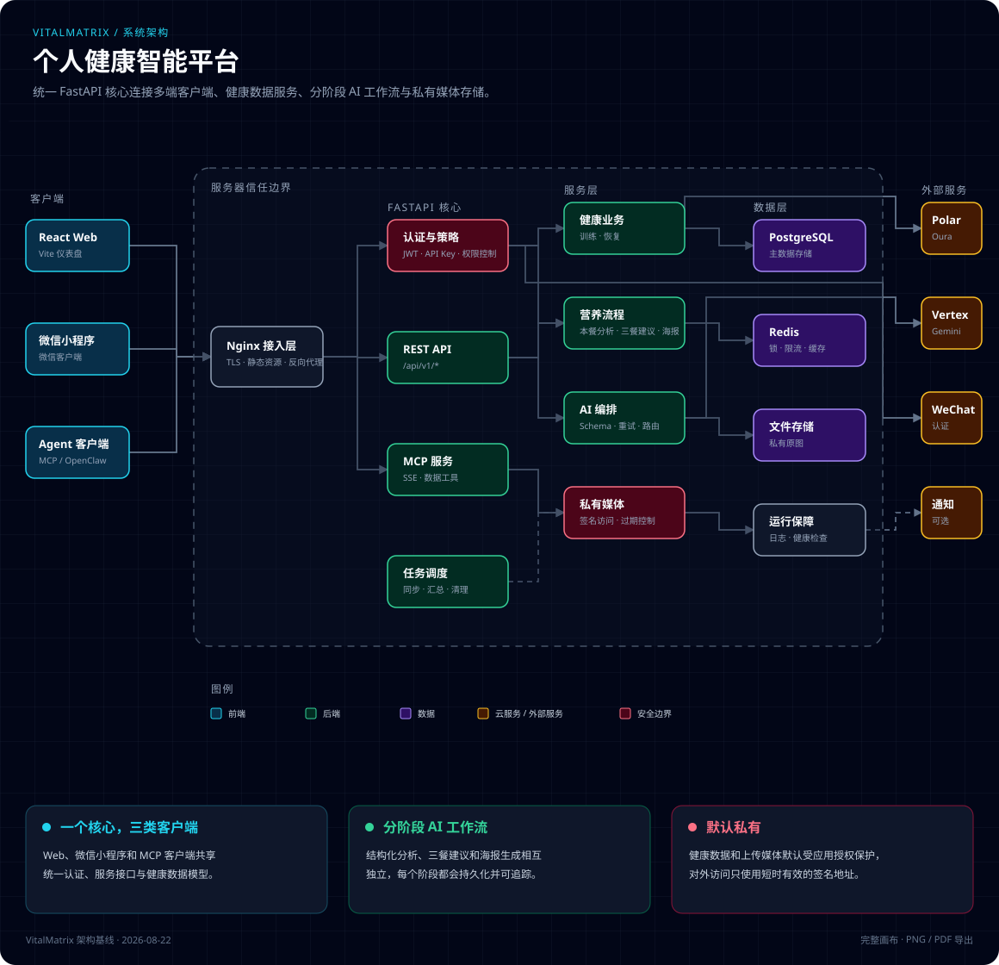
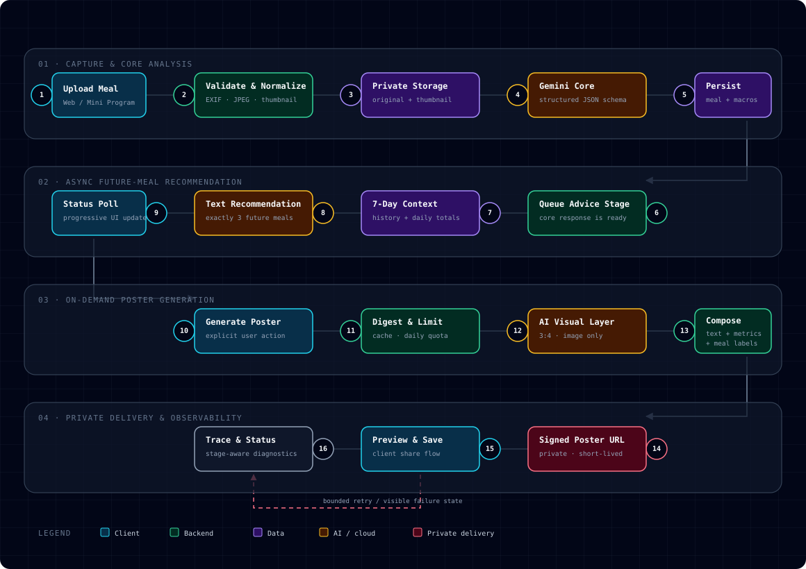

# Architecture diagrams

本目录保存 VitalMatrix 的架构图和流程图。每张图提供两种格式：

- `.svg`：GitHub README 和 Markdown 文档中的直接预览版本。
- `.html`：下载到本地后用浏览器打开的交互版本，右上角菜单支持复制图片、导出 PNG 和导出 PDF。GitHub 不执行仓库中的 HTML，因此直接点击 HTML 文件时会显示源码。

## 图表

### VitalMatrix 系统架构

[SVG 图片](vitalmatrix-system-architecture.svg) · [HTML 交互版](vitalmatrix-system-architecture.html)

### 营养分析与海报生成流程

[SVG 图片](nutrition-poster-workflow.svg) · [HTML 交互版](nutrition-poster-workflow.html)

## 维护约定

- 架构或关键数据流发生变化时，同步更新对应 HTML 和引用它的文档。
- 图表只描述小程序与服务端的接口边界；公开仓库同步不得用服务器副本覆盖小程序的权威源码。
- 图表遵循 [architecture-diagram-generator](https://github.com/Cocoon-AI/architecture-diagram-generator) 的布局和导出规范。
- CDN 依赖固定版本并保留 SRI 校验；图表不得包含密钥、真实域名、机器绝对路径或私有数据。
